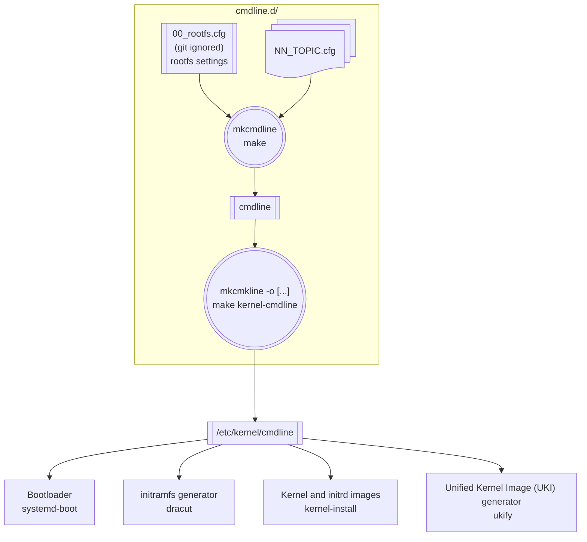

 [](https://github.com/Falkor/mkcmdline) [](LICENCE) [](https://github.com/Falkor/mkcmdline/issues)

	  _		_					 _	__					  _						 _ _ _
	 | |   (_)_ __	_	___	 __ | |/ /___ _ __ _ __	  ___| |   ___ _ __ ___	  __| | (_)_ __	  ___
	 | |   | | '_ \| | | \ \/ / | ' // _ \ '__| '_ \ / _ \ |  / __| '_ ` _ \ / _` | | | '_ \ / _ \
	 | |___| | | | | |_| |>	 <	| . \  __/ |  | | | |  __/ | | (__| | | | | | (_| | | | | | |  __/
	 |_____|_|_| |_|\__,_/_/\_\ |_|\_\___|_|  |_| |_|\___|_|  \___|_| |_| |_|\__,_|_|_|_| |_|\___|
															 _
							  __ _	___ _ __   ___ _ __ __ _| |_ ___  _ __
							 / _` |/ _ \ '_ \ / _ \ '__/ _` | __/ _ \| '__|
							| (_| |	 __/ | | |	__/ | | (_| | || (_) | |
							 \__, |\___|_| |_|\___|_|  \__,_|\__\___/|_|
							 |___/
	 .			 Copyright (c) 2022-2026 Sebastien Varrette

# Linux kernel's command-line parameters `cmdline` generator

*  [Official Kernel's command-line parameters list](https://docs.kernel.org/admin-guide/kernel-parameters.html)

This repository provides the resources needed to **converts splitted kernel cmdline configuration files `NN_*.cfg` into a valid `cmdline` file** (single line, appending all kernel parameters, excluding any comments) as expected from bootloaders such as [systemd-boot](https://systemd.io/BOOT/), `kernel-install` or UKI generators such as [`ukify`](https://www.freedesktop.org/software/systemd/man/latest/ukify.html).
The supporting workflow is illustrated below:



## Motivations

This repository holds _splitted_ commented configurations for the kernel `cmdline` parameters (so what should have been the content of `/etc/kernel/cmdline.d`) and resources to generate out of them a single line `cmdline` file aggregating in a single line all theses parameters, without comments.

Such a file (and format) is used within bootloaders as [systemd-boot](https://systemd.io/BOOT/) which relies on the [`kernel-install`](https://www.freedesktop.org/software/systemd/man/latest/kernel-install.html) tool to grab from `/etc/kernel/cmdline` the kernel command line to use.
The same goes when you wish to generate a [UKI](https://github.com/uapi-group/specifications/blob/main/specs/unified_kernel_image.md) (Unified Kernel Image), _i.e._  the `ukify` script (coming from the `systemd-ukify` package) typically takes the path to the kernel command line file (`/etc/kernel/cmdline`) as parameter to embded its content into the "`.cmdline`" section.
Furthermore, initramfs generator like [Dracut](https://dracut-ng.github.io/) also makes use of such a file.

Yet there is currently no way[^1] to natively handle splitted cmdline configuration (under `/etc/kernel/cmdline.d/` typically), and no initiative (at least to my knowledge) to support **commented** files as it can be done with the [Grub 2](https://www.gnu.org/software/grub/) bootboader, where splitted configurations are natively handled under `grub.d/` (yet with a very annoying syntax requiring to always overload `GRUB_CMDLINE_LINUX`).

So that's the objective of this project I use for my systems, which:

* keep splitted commented configurations as `[0-9]*.cfg` files
* rely on an aggregator script [`mkcmdline`](mkcmdline) to generate, out of these files, a (hopefully) valid `cmdline` file (single line, appending all kernel parameters).
* to limit the risk of introducing bad or mispelled directives, the provided parameters are checked against the [reference list of kernel parameters](https://github.com/torvalds/linux/blob/master/Documentation/admin-guide/kernel-parameters.txt).
  Any deviation is indicated but does not stop the process (as it may be a normal situation, typically for specific modules/drivers options).
* displaying (when applicable) the difference(s) between the generated file and `/etc/kernel/cmdline`

[^1]: Note that dracut however natively support `/etc/cmdline.d/*.conf` to specify additional command line options.

**`/!\ IMPORTANT`: you still need to synchronize the locally generated `cmdline` file onto `/etc/kernel/cmdline`** (see below for ways to do it)

## Installation and Repository Setup

```bash
### TL:DR; - /!\ ADAPT root directory according to your tastes ;)
mkdir -p ~/devel/kernel && cd ~/devel/kernel
# ... now clone the repository under cmdline.d
git clone https://github.com/Falkor/mkcmdline.git cmdline.d
cd cmdline.d
# You probably wish to create a symlink under /etc/kernel pointing to this working copy
sudo ln -s $(pwd) /etc/kernel/cmdline.d
```

Now you need to **edit** `00_rootfs.cfg` to match your rootfs setup - this file is _on purpose_ [git ignored](.gitignore). An [example](00_rootfs.cfg.example) is provided - complete it as needed (UUID etc.)

```bash
cp 00_rootfs.cfg.example 00_rootfs.cfg
$EDITOR 00_rootfs.cfg
```

You will also need to install a descent diffing tool. [`wdiff`](https://www.gnu.org/software/wdiff/) should be preferred. You may also consider [delta](https://github.com/dandavison/delta).

> The GNU wdiff program is a front end to diff for comparing files on a word per word basis.

```bash
sudo apt install wdiff colordiff
```

## Guided generation with `Makefile`

Only applicable when within the current `cmdline.d` directory.

| **Directive** | **Description**                                        | **Alias(es)** `make [...]`   |
| :---------:   | :-------------------------                             | :--------------------------- |
| `make`        | Locally generate `cmdline`                             | `make local`                  |
| `make system` | Generate `/etc/kernel/cmdline`                         | `make sync` or `make kernel-cmdline` |
| `make uki`    | [re]generate UKI / kernel to integrate the new cmdline | `make kernel-install`        |

See also `make help` for all available directives

## `mkcmdline` script Usage

See also [`mkcmdline -h`](mkcmdline).
This script converts splitted `NN_*.cfg` configurations files into a valid `cmdline` file (single line, appending all kernel parameters). In practice, the following actions are performed:

- ensure you have `[0-9]*.cfg` file(s) as sources
- if needed, fetch kernel parameters reference list from [linux kernel documentation](https://github.com/torvalds/linux/blob/master/Documentation/admin-guide/kernel-parameters.txt) as [`kernel-parameters.txt`](https://github.com/torvalds/linux/blob/master/Documentation/admin-guide/kernel-parameters.txt)
- extract all tokens from <N>*.cfg files and:
  1. check the validity of the proposed kernel parameters. In case they are not found in kernel-parameters.txt, this is indicated (it may be a normal situation, typically for specific modules/drivers options)
  2. prepare the final `cmdline` aggregating these token sorted as follows:
     - parameters from 0_*.cfg are placed first untouched (since they holds rootfs identification and it's the first information you want
       - rest of the parameters are alphabetically sorted (to facilitate
         later the search for a given parameter with a [long] [/proc/]cmdline)
  - generating cmdline file (default: cmdline)
  - displaying (when applicable) difference(s) with the current
    /etc/kernel/cmdline


```
USAGE
  mkcmdline [-c] [-x] [-d DIR] [-o FILE]

OPTIONS:
  -c --check     Check validity of the parsed kernel parameters against the
                 reference list kernel-parameters.txt, as fetched from
                 torvald/linux repository.
                 see Documentation/admin-guide/kernel-parameters.txt
                 While naive, this approach proved to be useful to detect
                 mispellings before rebooting.
                 Enabled by default.
                 Note: unless wrong, there is no official linting program
                 for kernel parameters...
  -d --dir DIR   Set location of cmdline.d directory hosting the [0-9]*.cfg
                 files. Default: '.' (or script directory
                  if no *.cfg are found under .)
  -n --dry-run   Dry run mode (**DEFAULT** mode): echo the commands to be run
  --no-check     DO NOT check validity of the kernel parameters
  -o FILE        set the output file. Default: cmdline
  -x --exec      Really execute the commands, i.e. don't just echo them
```

Example:

```bash
./mkcmdline -h

# Generate 'cmdline' from [0-9]*.cfg in the current or cmdline.d repo directory:
./mkcmdline    # Dry-run: show commands to be executed
./mkcmdline -x # => cmdline

# Update /etc/kernel/cmdline:
sudo mkcmdline -o /etc/kernel/cmdline    # Dry-run
sudo mkcmdline -o /etc/kernel/cmdline -x
```

Assuming `$HOME/bin` if part of your PATH, you may wish to symlink the `mkcmdline` script into your `~/bin` directory, typically as follows:

```bash
ln -s $(pwd)/mkcmdline ~/bin/mkcmdline
```

Finally, as mentionned before, there is also a [`Makefile`](Makefile) piloting all these operations:

```bash
make   # => ./cmdline
make kernel-cmdline # or 'make system' or 'make sync' => /etc/kernel/cmdline
make uki # => generate /etc/kernel/cmdline and run kernel-install on the *current* kernel (uname -r)
```

## Managing grub.d resources

Even if there are excellent reasons to get rid of [Grub 2](https://www.gnu.org/software/grub/) from a [security](https://www.cvedetails.com/vulnerability-list/vendor_id-72/product_id-32736/GNU-Grub2.html?page=1&order=3) point of view (and thus switch to safer alternatives as [systemd-boot](https://systemd.io/BOOT/)), it remains a popular UEFI bootloader, and there exists several excellent resources for hardened grub configurations (see for instance the  [grub configuration](https://github.com/Kicksecure/security-misc/tree/master/etc/default/grub.d) maintained by the [KickSecure security-misc](https://github.com/Kicksecure/security-misc) project).

For this reasons, you can keep all theses configurations under `grub.d/` and rely on the [`convert-grub-config`](convert-grub-config) script to convert all grub files `grub.d/[0-9]+.*\.cfg` into the corresponding `.cfg` files in the current directory compliant with the `cmdline` format (basically, it get rid of all `GRUB_CMDLINE_LINUX` and `GRUB_CMDLINE_LINUX_DEFAULT` parts)

```bash
./convert-grub-config -h
./convert-grub-config    # Dry-run
./convert-grub-config -x
```

_Note:_ if you want to keep track of the latest changes of the [grub configuration](https://github.com/Kicksecure/security-misc/tree/master/etc/default/grub.d) maintained by the [KickSecure security-misc](https://github.com/Kicksecure/security-misc) project, a dedicated script (under `grub.d/`) setup everything for you via `make setup-grub-config`. In details:

```bash
cd grub.d
./setup-kicksecure-config -h
./setup-kicksecure-config    # Dry-run: show commands to be executed
./setup-kicksecure-config -x
```

## Issues / Feature request

You can submit bug / issues / feature request using the [`Falkor/mkcmdline` Project Tracker](https://github.com/Falkor/mkcmdline/issues)

## Licence

This project and the sources proposed within this repository are released under the terms of the [MIT](LICENCE) licence.
